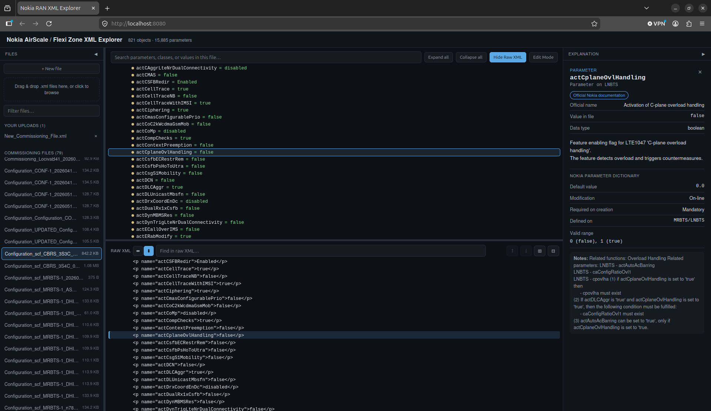
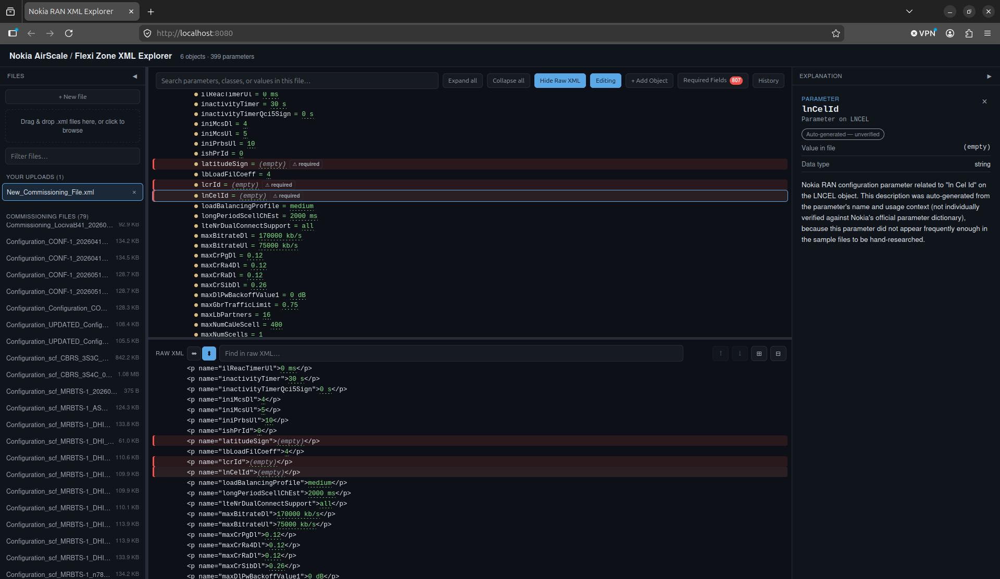

# Nokia AirScale / Flexi Zone XML Explorer

[](LICENSE)
[](backend/)
[](frontend/)
[](docker-compose.yml)
[](https://github.com/paulmataruso/nokia-xml-explorer/tags)
[](https://github.com/paulmataruso/nokia-xml-explorer/commits/main)
[](https://github.com/paulmataruso/nokia-xml-explorer/stargazers)

A self-hosted web tool for browsing, editing, and generating Nokia RAN
commissioning/configuration XML files (the RAML `raml21.xsd` "SCF"/CM-data
format used by BTS Site Manager and NetAct for AirScale and Flexi Zone
LTE/NR base stations) as an interactive tree, with a built-in knowledge base
explaining every managed object class and configuration parameter — no more
scrolling through thousands of lines of flat XML to find what a parameter
does or whether a file is actually complete.

Supports both the older `com.nokia.mrbts:*`/`NOKLTE:*` (Flexi Zone/BTS Site
Manager) object model **and** the current unified **SRAN** (SingleRAN)
AirScale object model (`com.nokia.srbts:*`, including 5G NR) — the parser
and knowledge base are built to handle both namespace families in the same
file, which is normal (see `ref_bts_parameters_lte18.xlsx` vs.
`SBTS_Parameters_18A.xls` in [Knowledge base](#the-knowledge-base--how-it-was-built-and-its-limits)).

Runs entirely locally in a single Docker container. Your commissioning
files never leave your machine.

**Status:** early, functional, actively developed. `v0.02`.



Click any object, parameter, or table row for a plain-English explanation
sourced from Nokia's own parameter dictionaries. The raw XML pane stays in
sync with whatever you click above.



Generate a fully-formed object from scratch — every Mandatory parameter is
either filled in with its real default or added as a red-flagged placeholder
you still need to set, tracked file-wide in the "Required Fields" panel.

## What it does

- Lists every `.xml` file placed in `scp/` (your commissioning files).
- Parses the flat RAML `managedObject` list into a real parent/child tree,
  reconstructed from each object's `distName` path (equipment → cabinet →
  baseband/radio modules → LTE/NR cells → features), instead of the raw
  flat XML order.
- **Click** a row to expand/collapse it. **Double-click** any object,
  parameter, table (`list`), or table row for a full plain-English
  explanation in the right-hand panel.
- Full-text search box filters the tree by parameter name, class, or value,
  highlighting matches inline. "Expand all" / "Collapse all" buttons for
  quickly opening up (or flattening) a whole file.
- **Show Raw XML** splits the view to show the file exactly as written —
  real tags, attributes, and nesting, drill-down collapsible like a browser's
  built-in XML viewer — side by side with the reconstructed tree. Choose
  **side-by-side or stacked (top/bottom)** layout, and drag to resize either
  way. Clicking a node in **either** tree scrolls to, expands, and highlights
  the corresponding node in the other. The raw pane has its own find bar
  (with match count and prev/next navigation) for searching the literal XML
  text.
- The file sidebar and the explanation panel can each be collapsed to a thin
  strip to reclaim screen space, and the sidebar's width is adjustable by
  dragging its edge.
- **Upload your own XML files** via the drag-and-drop card at the top of the
  sidebar (or click it to browse). Uploaded files are validated as RAML XML
  before being accepted, listed separately under "Your uploads," and can be
  deleted from there with the × button.
- **Edit Mode**: click any parameter's value (in either pane) to edit it in
  place. `scp/` originals stay read-only forever — editing one first makes
  an editable copy in "Your uploads" via a one-click banner, so the source
  file is never touched. Every edit is validated (re-parsed) before being
  written to disk.
- **History**: every edit automatically snapshots the file's prior state, so
  you can open the History panel on any uploaded/edited file and restore an
  earlier version if something goes wrong. Restoring itself is undoable —
  it snapshots the current state first.
- A file-level "File Info" node explains the `raml`/`cmData`/`header`/`log`
  wrapper elements themselves.
- **Generate new XML**: "+ New file" in the sidebar creates a blank, valid
  commissioning file; "+ Add Object" builds a real `<managedObject>` from a
  form — pick a parent (defaults to whatever's currently focused), pick a
  class (narrowed to classes actually observed under that parent in your
  corpus), fill in parameters with corpus-grounded suggestions, and it's
  appended with an auto-numbered `distName`, the right namespace-qualified
  class string, and a matching `version` borrowed from a sibling in the same
  file. Every generated object is re-parsed before being written, and, like
  any other edit, automatically snapshotted first.

## The knowledge base — how it was built, and its limits

This tool ships a knowledge base built in three layers:

1. **Corpus-driven baseline.** Every file in `scp/` was parsed to extract
   every managed-object class and parameter/table name actually present.
   The most-frequently-occurring parameters and all classes were
   individually researched using RAN/3GPP engineering knowledge; the
   remaining rare ones got a deterministic heuristic name-decomposition
   fallback. See `scripts/extract_inventory.py` and `scripts/build_knowledge.py`.
2. **Official Nokia parameter dictionaries overlay.** `ref/` contains two
   genuine Nokia parameter dictionary exports:
   - `ref_bts_parameters_lte18.xlsx` (2018) — the older `com.nokia.mrbts:*` /
     `NOKLTE:*` (Flexi Zone / BTS Site Manager) object model, ~8,250 FDD +
     ~7,690 TDD parameter definitions.
   - `SRAN18AISSUE03HTML/.../SBTS_Parameters_18A.xls` (2019) — the current,
     unified SingleRAN AirScale dictionary covering the `com.nokia.srbts:*`
     namespace (including 5G NR), ~10,238 parameter definitions across 426
     classes.

   `scripts/extract_official_reference.py` / `extract_sbts18a_reference.py`
   parse both; `scripts/merge_official_reference.py` cross-references every
   parameter name actually used in `scp/` against **both** dictionaries and,
   on a match, **replaces the researched/heuristic entry with Nokia's own
   description, valid range, default value, modification rules,
   required-on-creation, license/feature requirement, and 3GPP reference** —
   preferring an exact match to the parameter's actual class in your corpus
   when the two dictionaries disagree, and otherwise favoring SBTS18A as the
   more current/relevant source. This currently upgrades **2,800 of 5,656
   parameters (49.5%, ~75% of all parameter *occurrences* across the corpus)**
   and enriches **220 of 297 classes** with an officially-verified full name
   and hierarchy path.
3. **Generator parameter catalog.** `scripts/build_class_catalog.py` builds
   `backend/app/data/class_catalog.json`, additionally widening each class's
   known parameters with official-only ones never exercised by a sample file
   (flagged `observed: false`, shown with a ⚑ in the "Add Object" form) —
   currently **1,682** such parameters across the corpus's 256 classes.

Every explanation in the UI carries a **confidence badge**:

| Badge | Meaning |
|---|---|
| Official Nokia documentation | Verbatim from the LTE18 or SBTS18A parameter dictionary in `ref/` |
| High confidence | Well-known 3GPP-standard concept or unambiguous Nokia convention |
| Medium / Low confidence | Best-effort engineering interpretation of a Nokia-internal parameter |
| Auto-generated — unverified | Produced by the heuristic name-decomposition engine, not individually researched |

Parameter names reused across many unrelated MO classes with genuinely
different official descriptions get the shortest substantial one as a safer
generic proxy, rather than one class's overly-specific text being shown
everywhere the name appears. Where the official dictionaries don't reach
(parameters newer than both, from 2019), the researched/heuristic layers
still apply — treat those as **engineering-reference-grade, not
vendor-official** documentation.

Note: `ref/` (the source parameter dictionaries and spreadsheets) isn't
included in this repo or the Docker image — only the merged, derived
knowledge base in `backend/app/data/` ships. If those files are ever
missing, the app falls back to an empty knowledge base (plain tree view,
editing, and generation all still work).

## Generating new XML

`ref/` also turned out to contain three legacy Excel-based "XML generator"
tools Nokia field engineers use (one with full VBA macros, reverse-engineered
in `ref/` analysis). All three follow the same underlying pattern: one sheet
per MO class, a header row of parameter names, one data row per instance,
and a handful of leading columns whose values get concatenated into the
`distName`. This tool's generator (`+ New file`, `+ Add Object`) implements
that same pattern natively, but goes further than the spreadsheets could:

- `scripts/build_class_catalog.py` builds `backend/app/data/class_catalog.json`
  by scanning every file in `scp/` for, per class, its real observed parent
  class and every scalar parameter's **actual observed values** — not the
  official dictionary's numeric enum codes. This distinction matters: Nokia's
  docs describe `administrativeState` as `1: unlocked, 2: shutting down, 3:
  locked`, but real commissioning XML in this corpus contains the text
  `"Unlocked"` / `"Locked"`. The generator's dropdowns and suggestions are
  always grounded in what real files actually contain.
- The catalog is then **widened twice over**:
  - With parameters valid for a class per the official dictionaries but
    never exercised by a sample file (marked `observed: false`, shown with
    a ⚑) — these fall back to the official range text as a hint, since
    there's no real-file value to ground a suggestion in yet.
  - With **every class either official dictionary documents** (490 total),
    not just the ~256 your corpus happens to use — so you can generate
    objects you have zero examples of. A class you've never seen gets its
    parent from the official MO Class Tree, and its `class` XML attribute's
    namespace prefix (which neither dictionary records directly — that's
    only ever visible in a real file) is **inferred from a sibling class
    under the same parent that has been observed** (e.g. every `APEQM`
    child in this corpus is `com.nokia.srbts.eqm:*`). This is flagged
    honestly: the API response and a dismissible in-app banner tell you
    `classVerified: false` whenever the class string is a best-effort
    guess rather than something actually confirmed in a real file, so you
    know to double-check it in Raw XML before relying on it.
- **Parent-child placement is cross-checked against the official MO Class
  Tree**, not just majority-vote from your corpus — 11 classes (`ETHLK`,
  `IPSECC`, `PMTNL`, `TWAMP`, and others tied to older transport object
  placement) had a corpus-observed "most common parent" that disagreed with
  Nokia's current documented hierarchy; the documented one now wins as the
  default, with every parent actually seen in your files kept as a valid
  alternate so real, working file structures still aren't rejected.
- **Required fields are flagged precisely, not just by the "Mandatory" tag.**
  The dictionaries' own field description says: *"Mandatory parameters with
  no default value defined must be filled in"* — so a parameter marked
  Mandatory but with a system default is fine left unset. Only
  Mandatory-with-no-default (`trulyRequired`) parameters are marked with `*`
  and guaranteed to appear in the form regardless of the default 25-field
  cutoff.
- **Every other Mandatory parameter is auto-filled with its real default,
  not left out.** For any Mandatory parameter you don't explicitly set,
  `+ Add Object` writes its official default value into the generated
  `<managedObject>` automatically, so the object is usable as written rather
  than silently missing fields a strict Nokia loader would reject.
  `scripts/build_class_catalog.py`'s `resolve_default_for_xml()` does the
  same coded-value-to-real-value translation described above for these
  defaults too (e.g. `administrativeState`'s documented default `"locked
  (3)"` resolves to the real-file text `"locked"`, `actDrx`'s `0.0` resolves
  to `"false"`) — cross-checked against corpus `exampleValues` when
  available, so the auto-filled value matches what real exports use, not
  the raw documented code. The API response's `autoFilledDefaults` list
  (and the object's full parameter set immediately after creation) shows
  exactly what got added.
- **No Mandatory parameter is ever silently left out of a generated object —
  the docs are the source of truth on what's required, not a hint.** A
  `trulyRequired` parameter (Mandatory, no safe default to fill in) still
  gets written into the object, as an empty placeholder (`<p name="..."/>`),
  instead of being omitted. That way every Mandatory field is visible and
  accounted for right after creation, not something you have to already
  know to go add yourself. Both the logical tree and the Raw XML view
  red-highlight (⚠ required) any row that's Mandatory per the docs but still
  has no value — including the rare case (~1.6% of resolvable defaults) where
  a documented default couldn't be confidently translated into a real-file
  value, so it also comes through blank and flagged rather than silently
  wrong. A **"Required Fields"** toolbar button (badge shows the live count)
  opens a table of every such gap across the *whole file* — object, class,
  parameter, and an inline input to fill it in on the spot via
  `PUT /api/files/{filename}/objects/param`, the same upsert endpoint "+ Add
  Parameter" uses — so you can clear every red flag from one place instead
  of hunting through the tree row by row. Clicking a row opens a side panel
  with that parameter's full explanation (description, valid range, unit,
  values actually seen in your files) — the same information ExplainPanel
  shows, built from the row data the endpoint already returns, no extra
  lookup needed.
- **You're not limited to what you set at creation.** Double-click any
  managed object (in Edit Mode) for a "+ Add Parameter" button that offers
  every remaining known parameter for that class — the generator form
  intentionally doesn't force you to fill in a class's entire parameter set
  up front (some have 500+), so this is how you come back and add more
  later without recreating the object.
- New objects get a namespace-qualified `class` string and `version`
  borrowed from a sibling of the same class already in the file (or the
  most common one in the corpus if this is the first), and an
  auto-numbered `distName` — matching real Nokia export conventions (e.g. a
  `com.nokia.mrbts:MRBTS` root with `NOKLTE:LNCEL` children is normal and
  expected, confirmed against the actual corpus, not a bug).
- Every generated or added parameter is re-parsed before being written to
  disk, and, like any edit, automatically snapshotted first.
- **"+ Add Object" cascades into required child objects, all the way down.**
  Neither official dictionary (nor any XSD -- there isn't one in `ref/`)
  records MO-class cardinality: they say whether a *parameter* is Mandatory,
  never whether a *child class* must exist at all under a given parent. The
  only signal available is a corpus heuristic computed by
  `build_class_catalog.py`: a child class counts as "required in practice"
  if it's present under **every single observed instance** of the parent
  class in `scp/` (e.g. `APEQM` → `CABINET`, `RMOD`; `RMOD` → `ANTL`; each
  class's `childSampleSize` records how many instances that's based on, so a
  class inferred from 50 samples and one inferred from a single file aren't
  presented as equally certain). Creating an object cascades into its
  required children, then recurses into *their* required children, and so
  on down the chain — each cascaded object gets its own Mandatory parameters
  filled in exactly the same way (default where resolvable, blank+flagged
  otherwise). The response's `cascadedObjects` list (and an in-app banner)
  shows everything that got created, plus any that failed, so a heuristic
  guess is never applied silently. This never creates *sibling* instances
  (e.g. it won't guess a cell count) — just the minimum one instance needed
  to satisfy each inferred requirement.
- **Objects and non-Mandatory parameters can be deleted, and objects can be
  renamed** (Edit Mode) via `DELETE /api/files/{filename}/objects`,
  `DELETE /api/files/{filename}/objects/param`, and
  `PUT /api/files/{filename}/objects/rename`. Two ways to reach these: a
  small × button near the start of each row (deliberately placed right after
  the label/tag rather than at the row's end, since a long value or distName
  can push "the end" of a row past the visible edge of these
  horizontally-scrolling panes), or **right-click any object or parameter
  row for a context menu** -- the more reliable option, since it opens at
  the cursor regardless of row width or scroll position. The context menu
  also has **Rename**, which changes just an object's trailing instance
  number (e.g. `LNCEL-1` → `LNCEL-0`, same class and parent) and rewrites
  the same prefix on every descendant's `distName`, since RAML distNames are
  literal ancestry paths, not references (`rename_managed_object` in
  parser.py). Deleting an object cascades to every descendant beneath it the
  same way. A Mandatory parameter can never be deleted, only edited --
  offering delete there would undo the guarantee above that every Mandatory
  field always has a value or is at least visibly flagged; there's no such
  restriction on deleting or renaming whole objects, since (per the point
  above) Nokia's docs don't define any class as officially required to
  exist in the first place.

**Current scope:** only scalar (`<p>`) parameters are generator-supported;
table/list parameters (e.g. neighbor relation tables, RLC/PDCP profiles)
aren't yet part of the "Add Object"/"Add Parameter"/delete/rename forms.
Rerun `python3 scripts/build_class_catalog.py` after adding files to `scp/`
to widen the catalog (and refresh the required-child-class inference).

## Running it

Requires Docker and Docker Compose.

```bash
docker compose up --build
```

Then open **http://localhost:8080**. A handful of sample commissioning
files (`example/`) are included and shown out of the box, so there's
something to explore even before you add your own.

The `scp/` directory is mounted **read-only** into the container — the
tool never modifies your commissioning files. Drop new `.xml` files into
`scp/` and refresh the file list in the browser (or reload the page) to
see them; no rebuild needed.

Files uploaded through the UI are written to `uploads/` on your host (a
separate, writable mount — `scp/` itself is never touched) and persist
across restarts. Delete them from the "Your uploads" list in the sidebar,
or just delete the file from `uploads/` directly. Automatic pre-edit
snapshots live in `snapshots/` on your host, one subfolder per file.

### Configuration

Copy `.env.example` to `.env` and adjust as needed — `docker compose` reads
it automatically, and every setting has a sane default, so this is entirely
optional:

| Variable | Default | Effect |
|---|---|---|
| `PORT` | `8080` | Host port to serve the app on. |
| `INCLUDE_EXAMPLES` | `true` | Show the bundled sample files alongside your own. Set `false` to hide them. |
| `SCP_HOST_DIR` | `./scp` | Where your commissioning files live on your machine (read-only). |
| `UPLOADS_HOST_DIR` | `./uploads` | Where uploaded/generated files are stored (writable). |
| `SNAPSHOTS_HOST_DIR` | `./snapshots` | Where edit-history snapshots are stored (writable). |
| `MAX_UPLOAD_MB` | `25` | Max size for a single file uploaded through the UI. |
| `MAX_SNAPSHOTS_PER_FILE` | `50` | How many snapshots to keep per file before pruning the oldest. |
| `CORS_ORIGINS` | `*` | Comma-separated allowed origins. Only matters if exposing this beyond localhost. |

e.g. `PORT=9000 docker compose up --build`, or set it in `.env` for
anything longer-lived.

## Project layout

```
example/                Bundled sample commissioning files, baked into the image (INCLUDE_EXAMPLES=false to hide)
scp/                    Your Nokia commissioning/configuration XML files (read-only mount)
uploads/                Files uploaded through the UI, and editable copies of scp/ files (writable mount)
snapshots/              Automatic pre-edit checkpoints, one folder per file (writable mount)
ref/                    Source Nokia reference documents (xlsx/xls/HTML docs) -- not shipped in the image
ref/pdf/                Flat copy of every PDF found anywhere under ref/ (manuals, install/EPD/quick guides), for easy browsing
ref/extracted/          JSON extracted from ref/ by extract_official_reference.py / extract_sbts18a_reference.py
backend/app/            FastAPI app: XML→tree parser, knowledge API, heuristic fallback, upload/edit/snapshot/generator handling
backend/app/data/       Merged knowledge base (classes.json, parameters.json, class_catalog.json)
frontend/               React + Vite tree-view UI
research/               Inputs/outputs of the knowledge-base research pass (not shipped in the image)
scripts/extract_inventory.py          Re-scans scp/ for every class/parameter name in use
scripts/build_knowledge.py            Merges research/output/* + heuristics into backend/app/data/*.json
scripts/extract_official_reference.py Parses ref/ref_bts_parameters_lte18.xlsx into ref/extracted/lte18_*.json
scripts/extract_sbts18a_reference.py  Parses ref/SRAN18AISSUE03HTML/.../SBTS_Parameters_18A.xls into ref/extracted/sbts18a_*.json
scripts/merge_official_reference.py   Upgrades backend/app/data/*.json with both official dictionaries (run AFTER build_knowledge.py)
scripts/build_class_catalog.py        Builds backend/app/data/class_catalog.json (per-class parent + parameter catalog) for the generator
Dockerfile, docker-compose.yml Single-container build (Vite build → FastAPI serves API + static frontend)
```

## Regenerating the knowledge base after adding new files

If you add commissioning files with parameters that weren't in the original
research set, they'll still get a heuristic (auto-generated) explanation
automatically — no steps required. To fold newly-common parameters into a
future *curated* research pass, and re-apply the official-dictionary
overlay (order matters — the two `extract_*` scripts only need rerunning if
`ref/` itself changes; `merge_official_reference.py` must run after
`build_knowledge.py`, since it upgrades whatever that just produced; and
`build_class_catalog.py` must run last, since the generator's catalog reads
the now-upgraded `parameters.json`):

```bash
python3 scripts/extract_inventory.py           # refresh research/input/final_*.json
# (re-run the research process for any newly-frequent parameter names, or
#  hand-edit research/output/params_extra_manual.json)
python3 scripts/build_knowledge.py             # rebuild backend/app/data/*.json
python3 scripts/merge_official_reference.py    # re-apply the official LTE18 + SBTS18A overlay
python3 scripts/build_class_catalog.py         # rebuild the generator's parameter catalog
docker compose up --build
```

All data-prep scripts need `openpyxl`/`xlrd` (`pip install openpyxl xlrd`);
they're offline tooling, not a runtime dependency of the app itself.

## Known limitations

- The one `.zip` "Snapshot" file in `scp/` (a full BTS diagnostic bundle —
  certs, logs, alarms, PM counters) is out of scope for v1 and is greyed
  out in the file list; this tool targets the RAML commissioning/config
  XML format specifically.
- A handful of files in the wild had stray text (apparently pasted from a
  PDF viewer) before/after the actual XML document; the parser strips this
  automatically, but any other more deeply corrupted files will show a
  parse-error message rather than a tree.
- **Editing rewrites the whole file** with clean, consistent indentation —
  it preserves every tag, attribute, and value exactly, but does not
  reproduce the original file's incidental whitespace byte-for-byte. Only
  parameter *values* are editable (not object/attribute structure).
- Two files prefixed `WWW_` were added from a web search for publicly
  available Nokia sample files (see git-free provenance: they came from
  `github.com/ruboarm/Nokia-XML-Dump-Parser` and `github.com/SBramhesh/Motu`,
  both validated against this tool's own parser before being added). Genuine
  public samples of this format are rare — most of what's out there is
  parser tooling with no bundled sample data.
- The official LTE18 dictionary is keyed by parameter *name* (matching this
  tool's own data model), not by (class, name) pair, even though Nokia's own
  source data is per-class. A small number of very generically-reused names
  (`administrativeState`, `name`, `spareNNN`, etc.) therefore show one
  representative official description rather than one exact description per
  MO class — still official and accurate, just not maximally class-specific
  in those particular cases.
- The other files under `ref/` (a generic telecom glossary, bulk-edit
  "XML generator" spreadsheets with live network data plugged in, and older/
  superseded parameter dictionary revisions) were inspected but not mined
  further — they either duplicated the LTE18 dictionary, covered out-of-scope
  RATs (2G/3G), or had negligible incremental coverage (+0.4% of corpus
  occurrences from the standalone Flexi Zone dictionary) for the effort of a
  full extraction.

## License

[GNU AGPL v3.0](LICENSE). If the network-copyleft terms don't work for your
use case, commercial licensing is available — open an issue or contact the
maintainer.
